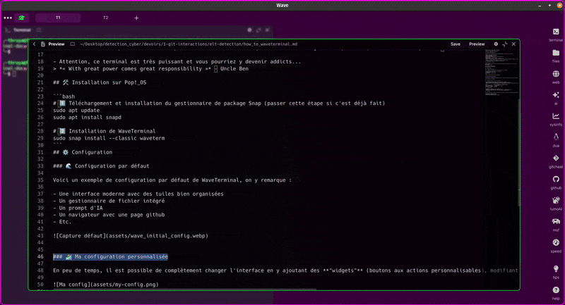
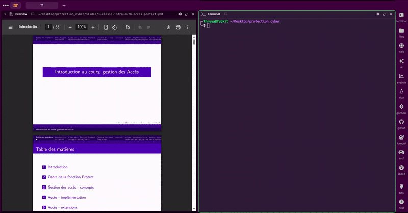

# WaveTerminal – Un terminal moderne et puissant !


## 📦 Qu’est‑ce que WaveTerminal ?

WaveTerminal est un émulateur de terminal **multiplateforme** et **open-source** qui propose :

- Gestion de **workspaces** multiples
- Interface **multifenêtre** très fluide
- Navigation web intégrée
- Raccourcis clavier **indépendants** du système d’exploitation
- Aperçu et édition de fichiers optimisée
- **IA intégrée**
- Hautement **personnalisable** (widgets, thème graphique, etc.)
- Mémoire de travail persistante même après extinction (une fois que vous avez configuré vos panneaux, ils restent en place d’une session à l’autre)
<br><br>
- Attention, ce terminal est très puissant et vous pourriez y devenir addicts...
<br>
> *« With great power comes great responsibility »* – Uncle Ben

## 🛠️ Installation sur Pop!_OS

```bash
# 1️⃣ Téléchargement et installation du gestionnaire de package Snap (passer cette étape si c'est déjà fait)
sudo apt update
sudo apt install snapd

# 2️⃣ Installation de WaveTerminal
sudo snap install --classic waveterm
```
>https://www.waveterm.dev/download
## ⚙️ Configuration

### 🌊 Configuration par défaut

Voici un exemple de configuration par défaut de WaveTerminal, on y remarque :

- Une interface moderne avec des tuiles bien organisées
- Un gestionnaire de fichier intégré
- Un prompt d'IA
- Un navigateur avec une page github
- Etc.


### 🏄 Ma configuration personnalisée

En peu de temps, il est possible de complètement changer l'interface en y ajoutant des **"widgets"** (boutons aux actions personnalisables), modifiant les couleurs du thème ou encore en **personnnalisant ses workspaces** :


<br><br>
>*J'utilise zsh avec Oh My Zsh à la place de bash pour mon shell (meilleur workflow et plus facilement personnalisable)*

## ⌨️ Pourquoi les raccourcis clavier sont essentiels ? (selon moi)

### 🌊 Dans WaveTerminal

- **Gain de temps** : passer d’un pane à l’autre sans quitter le terminal.  
- **Workflow fluide** : lancer rapidement des scripts, ouvrir de nouveaux workspaces, etc.  
- **Navigation** : naviguer efficacement dans les répertoires, présivualiser et éditer divers types de fichiers, etc.
- **Cohérence** : les raccourcis de WaveTerminal ne sont pas masqués par ceux de Pop!_OS, ce qui empêche les conflits.
<br>
>https://docs.waveterm.dev/keybindings

### 🐧 Dans Pop!_OS

- **All of the above** : pour les mêmes raisons de fluidité, d'efficacité et de confort que celles citées ci-dessus.

## 🎨 Personnalisation

La personnalisation va au sens large dans WaveTerminal *(merci l'open-source!)*. Changements d'apparence, de fonctionnalités, ajout de scripts spécifiques : **tout est possible** *(et relativement facilement)*!
<br><br>
Vous n'avez plus qu'à vous lancer en parcourant la documentation moderne et lisible de WaveTerminal : https://docs.waveterm.dev/

## 🐘 Mémoire de travail *(Workspaces)*

Une des fonctionnalités les plus utile et puissante concerne la mémoire de travail. Sur Pop!_OS, si j'éteins ma machine et que je la rallume, je perds toute ma session de travail. Avec WaveTerminal, je peux configurer différents espaces de travail et leur donner un nom ainsi une icône avec une couleur au choix. Chacun de ces *workspace* est considéré comme une session à part entière. **Si je quitte l'une d'entre elle, à mon retour, elle sera dans le même état qu'à mon départ :**
<br>


